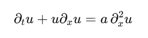

# Another dedalus project 1

# **Introduction to Dedalus - Burgers and KdV Equations**

**개요(Overview):**

이 노트북은 Dedalus v3 API에 대한 소개를 제공하며, 1차원 Burgers 방정식과 KdV 방정식을 설정하고 푸는 과정을 단계적으로 설명합니다.

**Dedalus 소개(About Dedalus):**

Dedalus는 전역 스펙트럴 방법(global spectral methods)을 사용하여 편미분방정식(PDE)을 푸는 오픈 소스 Python 패키지입니다. 이 방법은 박스나 구(sphere)와 같은 단순한 영역에서 매끄러운 해를 갖는 PDE에 대해 매우 정확한 수치 해를 제공합니다. Dedalus는 희소 다항식 기반(sparse polynomial bases)을 활용하는 현대적인 병렬 알고리즘을 포함하고 있으며, 모든 기능을 직관적인 기호(symbolic) 인터페이스를 통해 사용할 수 있습니다. Dedalus 코드는 다양한 분야에 널리 적용되어 왔으며, 특히 유체역학 문제에 자주 사용됩니다.

준비 단계 코드

```
%matplotlib widget

import numpy as np
np.seterr(over="raise")
dtype = np.float64

import matplotlib.pyplot as plt

import dedalus.public as d3

root_logger = logging.getLogger()
if root_logger.handlers:
    for handler in root_logger.handlers:
        root_logger.removeHandler(handler)

# import logging
logger = logging.getLogger(__name__)
```

### **1.1. Coordinates**

PDE의 공간 좌표는 Dedalus에서 **coordinate 객체**로 표현됩니다.

1차원 문제의 경우, 개별 좌표는 `Coordinate` 클래스를 사용해 정의할 수 있습니다.

다차원 문제에서는 여러 좌표를 결합하여 `CoordinateSystem`을 만들 수 있습니다.

Dedalus에서 현재 사용 가능한 좌표계는 다음과 같습니다:

- **CartesianCoordinates**: 임의 차원의 데카르트 좌표계
- **PolarCoordinates**: 극좌표계(방위각, 반지름)
- **S2Coordinates**: 2-구면 좌표계(방위각, 여위각)
- **SphericalCoordinates**: 3D 구면 좌표계(방위각, 여위각, 반지름)

이제 우리가 사용할 1차원 영역(domain)을 위해 `x`라는 이름의 좌표 객체를 만들어 보겠습니다:

xcoord = d3.Coordinate('x')

### **1.2. Distributors**

디스트리뷰터(distributor) 객체는 **필드의 병렬 분해와 변환**을 처리하며, 시리얼(serial)로 실행할 때조차도 모든 문제에서 필요합니다. 디스트리뷰터를 생성하기 위해서는 PDE에 사용할 **좌표(또는 좌표계)** 를 제공하고, 필드의 **데이터 타입(datatype)** 을 지정하며, 선택적으로 병렬화를 위한 **프로세스 메쉬(process mesh)** 를 정의할 수 있습니다.

이제 단일 좌표를 사용하고, **실수(real-valued)** 변수를 갖는 문제를 위한 디스트리뷰터를 만들어 보겠습니다.

dist = d3.Distributor(xcoord, dtype=np.float64) # No mesh for serial / automatic parallelization

### **1.3: Bases**

Dedalus에서 각 종류의 기저(basis)는 **별도의 클래스**로 표현됩니다. 이 클래스들은 해당 기저에 맞는 **스펙트럴 연산자**와, 함수 표현을 **그리드 공간(grid space)** 과 **계수 공간(coefficient space)** 사이에서 변환하는 방법을 정의합니다.

가장 흔히 사용되는 기저들은 다음과 같습니다:

- **RealFourier** — 구간에서 정의된 실수 주기 함수(코사인·사인 모드 사용)
- **ComplexFourier** — 구간에서 정의된 복소 주기 함수(복소 지수 함수 사용)
- **Chebyshev** — 구간 위의 일반 함수
- **DiskBasis** — 극좌표계에서 원판(disk) 전체 위의 함수
- **AnnulusBasis** — 극좌표계에서 도넛 형태의 고리(annulus) 위의 함수
- **SphereBasis** — S2 또는 구면 좌표에서 2-구(sphere) 위의 함수
- **BallBasis** — 구면 좌표에서 3D 구(ball) 전체 위의 함수
- **ShellBasis** — 구면 좌표에서 구 껍질(shell) 위의 함수

1차원 데카르트 기저는 다음 요소들로 생성됩니다:

- 해당하는 **좌표 객체**
- 기저의 **모드(mode) 개수**
- 구간의 **좌표 경계(bounds)**
- 선택적 **dealiasing 스케일 팩터**
    - 그리드 공간으로 변환할 때 모드를 얼마나 패딩할지 지정
    - 예: 비선형항이 2차일 경우 `3/2`

이제 우리의 좌표에 대해, 특정 해상도(resolution), 도메인 크기, 그리고 dealiasing 계수를 갖는 **Real Fourier basis**를 만들어 봅시다.

```
# Parameters
Lx = 10
Nx = 1024
dealias = 3/2

# Basis
xbasis = d3.RealFourier(xcoord, size=Nx, bounds=(0, Lx), dealias=dealias)
```

각각의 기반(basis)은 초기화나 필드(field) 시각화와 같은 작업에 사용할 수 있는 **대응하는 좌표(grid) 또는 콜로케이션 그리드(collocation grid)** 를 갖고 있습니다. (다차원 기반의 경우 여러 그리드를 가질 수 있습니다.)

기반의 로컬(local) 그리드는 **디스트리뷰터(distributor) 객체의 `local_grid` 메서드**를 통해 접근할 수 있습니다.

이 메서드는 선택적으로 **scale 인자**를 받을 수 있는데, 이 값은 **기반 모드 수에 대해 그리드 점(grid points)을 어느 정도 비율로 사용할지** 결정합니다.

초기화와 출력 작업은 보통 **정규 그리드(scale=1)** 에서 수행됩니다.

반면, 비선형 계산은 Dedalus 내부에서 각 기반에 대해 **지정된 dealiasing scale**이 적용된 그리드 위에서 수행됩니다.

```
normal_grid = dist.local_grid(xbasis, scale=1)
dealiased_grid = dist.local_grid(xbasis, scale=3/2)

print('Regular grid size:', normal_grid.size)
print('Dealiased grid size:', dealiased_grid.size)
```

# **2. Fields and Operators**

### **2.1: Fields**

Dedalus에서 **필드(Field)** 객체는 선택된 기준(base)들의 집합(즉, "도메인") 위에 정의된 **스칼라 값의 필드**를 나타냅니다.

다차원 문제의 경우, **VectorField** 및 **TensorField** 클래스를 사용하여 **벡터 필드** 또는 **텐서 필드**도 생성할 수 있습니다.

이제 우리가 만든 **1차원 기반(basis)** 을 사용하여 하나의 필드를 만들어 봅시다.

u = dist.Field(name='u', bases=xbasis)

Field 객체는 Dedalus에서 **기저(basis)들의 집합(“도메인”) 위에 정의된 스칼라값 필드**를 표현합니다.

다차원 문제의 경우, `VectorField`와 `TensorField` 클래스를 사용하여 **벡터 필드**나 **텐서 필드**도 생성할 수 있습니다.

이제 우리가 만든 **1차원 기저(basis)** 를 사용하여 필드를 하나 만들어 보겠습니다

```
x = dist.local_grid(xbasis)
k0 = 2 *np.pi /Lx
u.change_scales(1)  # Set values on regular grid
u['g'] = np.cos(4 *k0 *x) +0.2 *np.sin(32 *k0 *x)

plt.figure(figsize=(6, 3.5))

plt.plot(x, u['g'])
plt.xlabel('x')
plt.ylabel("u['g']");
```

필드는 계수 공간(coefficient space) 데이터가 필요할 때, 해당 데이터를 요청함으로써 스펙트럴 계수로 변환할 수 있습니다.

이 작업은 내부적으로 **필드 데이터에 대한 제자리(in-place) 스펙트럴 변환**을 자동으로 수행합니다.

RealFourier 기저에서는 계수가 **실수 기반의 코사인 계수와 (음의) 사인 계수가 번갈아(interleaved) 배치된 형태**로 저장됩니다.

주파수는 해당 영역(domain)의 **기본 주파수(fundamental frequency)** 를 기준으로 표현됩니다.

```
plt.figure(figsize=(6, 3.5))

plt.plot(u['c'][0::2], label='cosine')
plt.plot(-u['c'][1::2], label='sine')

plt.xlabel('k/k0')
plt.ylabel("u['c']")

plt.xlim(0, 50)
plt.legend()
plt.tight_layout()
```

### **2.2: Operators**

수학적 연산(산술, 미분, 적분, 보간 등)은 Dedalus에서 **Operator 클래스**로 표현됩니다.

연산자 클래스의 인스턴스는 특정한 수학적 표현을 나타내며, 시간이 흐르면서 값이 변할 수 있는 필드들을 인자로 받아 **지연 평가(deferred evaluation)** 방식으로 해당 표현을 계산할 수 있는 인터페이스를 제공합니다.

필드들 사이의 산술 연산, 혹은 필드와 스칼라 사이의 연산은 파이썬의 **중위 연산자(infix operator)** 와 NumPy의 **유니버설 함수(ufunc)** 를 사용해 직접 표현할 수 있습니다.

```
v_op = np.exp(1 +2 *u)

print(v_op)

```

우리가 얻는 객체는 또 다른 필드가 아니라, **지정된 수학적 연산을 표현하는 연산자(operator) 객체**입니다.

이 연산자는 시간이 지나며 값이 변할 수 있는 입력 필드들에 대해, 해당 수학적 표현을 **지연 평가(deferred evaluation)** 할 수 있는 인터페이스를 제공합니다.

이 연산자를 **기호적(symbolic) 그래프** 형태로 시각화하기 위해,

`dedalus.tools` 모듈에 있는 보조 함수를 사용할 수 있습니다.

```
from dedalus.tools.plot_op import plot_operator

plot_operator(v_op, figsize=4, fontsize=10, opsize=0.3)
plt.tight_layout()
```

연산을 실제로 계산하기 위해 우리는 연산자의 `evaluate` 메서드를 사용하며, 이 메서드는 결과를 포함하는 새로운 필드를 반환합니다. 기저(basis)를 생성할 때 지정한 디앨리어싱(dealiasing) 스케일 계수들은 모든 연산을 평가할 때 적용되므로, 플로팅하기 전에 필드를 다시 정규 격자(regular grid)로 리스케일해야 합니다.

```
v = v_op.evaluate()
v.change_scales(1)  # View values on regular grid

# Plot grid values
plt.figure(figsize=(6, 3.5))

plt.plot(x, v['g'])

plt.xlabel('x')
plt.ylabel("v['g']");
```

카르테시안 좌표계에서의 편도함수는 **Differentiate** 연산자를 사용하여 계산할 수 있습니다. 또한 **Integrate**, **Average**, **Interpolate** 연산자를 통해 **정적분**, **영역 평균**, **지점 보간**도 지원됩니다.

예를 들어, 이러한 방법을 사용하여 **v의 평균값**을 계산할 수 있으며, **v의 도함수의 평균값**도 계산할 수 있습니다(이는 주기성 때문에 0이 되어야 합니다).

```
ave = lambda a: d3.Average(a)
dx = lambda a: d3.Differentiate(a, xcoord)

print(ave(v).evaluate()['g'])
print(ave(dx(v)).evaluate()['g'])
```

다차원 문제에서는 다음과 같은 내장 벡터 미적분 연산자를 사용하는 것이 더 일반적입니다:

- **Gradient** — 임의의 필드에 대한 기울기
- **Divergence** — 벡터 및 텐서 필드에 대한 발산
- **Curl** — 벡터 필드에 대한 회전
- **Laplacian** — 기울기의 발산으로 정의되며, 임의의 필드에 적용 가능
- **Trace** — 텐서의 트레이스를 계산
- **TransposeComponents** — 텐서 지수를 전치
- **Symmetrize** — 텐서 성분을 대칭화
- **VectorPotential** — 솔레노이드(solenodial) 필드로부터 벡터 퍼텐셜을 구성

이 외에도 텐서 성분을 조작하기 위한 여러 추가 연산자들이 제공됩니다.

## **3. Problems and Solvers**

## **3.1: Problems**

Dedalus는 모든 초기값 문제(initial value problem)의 정식화를 표준화하기 위해, 기호적으로 지정된 방정식과 경계 조건의 계(system)를 다음과 같은 일반적인 형태로 표현합니다:

M⋅∂tX+L⋅X=F(X,t)M \cdot \partial_t X + L \cdot X = F(X, t)

M⋅∂tX+L⋅X=F(X,t)

여기서 MMM과 LLL은 **선형 미분 연산자로 구성된 행렬**, XXX는 **미지수 필드들로 이루어진 상태 벡터**, FFF는 **비선형 표현들로 이루어진 벡터**입니다.

방정식의 좌변(LHS)은 **시간 미분에 대해 1차**이고 **문제 변수들에 대해 선형**이어야 합니다. 반면 우변(RHS)은 **비선형 항이나 시간 의존 항을 포함할 수 있지만**, **시간 미분 항은 포함할 수 없습니다**.

문제 객체(problem object)를 생성하기 위해서는 먼저 **해를 구할 필드 변수들의 목록**을 제공해야 합니다. 또한 문제를 인스턴스화할 때 `namespace` 인자를 통해 **연산자나 함수를 치환(substitute)**할 수 있는 딕셔너리를 전달할 수 있습니다. 일반적으로 `locals()`를 전달하여 스크립트 레벨에서 정의된 모든 항목이 문제 정의 내부에서 사용 가능하도록 합니다.

방정식은 **(LHS, RHS)** 형식의 연산자 표현 쌍으로 지정할 수도 있고, **"LHS = RHS"** 형태의 문자열로도 지정할 수 있습니다. 제공된 namespace 내에서 사용 가능한 치환뿐 아니라, Dedalus의 문자열 파서는 **모든 내장 연산자**와 일부의 **공통 약칭(abbreviations)**도 자동으로 인식합니다.

예시로, 지금까지 사용한 도메인 위에서 **Burgers 방정식**을 설정해 보겠습니다:



```
# Parameters
a = 2e-3

# Problem
problem = d3.IVP([u], namespace=locals())
problem.add_equation("dt(u) -a *dx(dx(u)) = -u *dx(u)");
```

### **3.2: Solvers**

각 문제 유형(IVP, EVP, LBVP, NLBVP)에는 해당 문제를 해결하기 위한 절차를 수행하는 **대응되는 솔버 클래스**가 있습니다. 솔버는 `problem.build_solver` 메서드를 사용해 생성합니다.

IVP의 경우, 솔버를 생성할 때 **시간적분(time-stepping) 방법**을 지정해야 합니다. 여러 다중 단계(multistep) 및 Runge–Kutta IMEX 기법이 제공되며(자세한 목록은 *timesteppers* 모듈 참조), 이름을 통해 선택할 수 있습니다.

```
timestepper = d3.SBDF2
solver = problem.build_solver(timestepper)
```

IVP의 경우, 시간 진화를 멈추기 위한 정지 조건을 설정할 수 있습니다. 이를 위해 `solver.stop_iteration`, `solver.stop_wall_time`(솔버 생성 이후 경과한 실제 시간, 초 단위), `solver.stop_sim_time` 속성을 지정하면 됩니다.

예를 들어, 시뮬레이션을 **t = 10**(시뮬레이션 단위)에서 멈추도록 설정해 보겠습니다:

```
stop_sim_time = 10
solver.stop_sim_time = stop_sim_time
```

IVP와 비선형 BVP의 경우, 시뮬레이션을 시작하기 전에 **상태 변수의 데이터(state variable data)를 직접 수정하여 초기 조건을 지정**합니다.

```
# Initial conditions
n = 20
u.change_scales(1)  # Set values on regular grid
u['g'] = np.log(1 +np.cosh(n)**2 /np.cosh(n *(x -0.2 *Lx))**2) /(2 *n)
```

IVP는 지정된 시간보폭(timestep)을 사용하여 `solver.step` 메서드로 시간에 따라 전진시킵니다. Dedalus IVP 시뮬레이션의 메인 루프를 제어하는 로직은 시뮬레이션 스크립트 내에서 명시적으로 작성됩니다. `solver.proceed` 속성은 설정된 정지 조건 중 하나라도 만족되면 `True`에서 `False`로 전환됩니다.

이제 정지 조건이 충족될 때까지 문제를 진행하면서, 몇 번의 반복마다 uuu의 격자(grid) 값을 복사해 보겠습니다. 이는 몇 초 정도면 실행됩니다.

```
# Main loop
timestep = 2e-3

u.change_scales(1)
u_list = [np.copy(u['g'])]
t_list = [solver.sim_time]

while solver.proceed:
    solver.step(timestep)
    if solver.iteration % 500 == 0:
        logger.info(f'Iteration={solver.iteration:4d}, Time={solver.sim_time:e}, dt={timestep:e}')
    if solver.iteration % 25 == 0:
        u.change_scales(1)
        u_list.append(np.copy(u['g']))
        t_list.append(solver.sim_time)
```

**시간 공간 Plot에 대한 또다른 문제**

```
plt.figure(figsize=(6, 4))

plt.pcolormesh(x.ravel(), np.array(t_list), np.array(u_list), cmap='RdBu_r', shading='gouraud', rasterized=True, clim=(-1, 1))

plt.xlim(0, Lx)
plt.ylim(0, stop_sim_time)

plt.xlabel('x')
plt.ylabel('t')
plt.title(f'Burgers equation: a viscous shock')
plt.tight_layout();
```

해가 점점 **쇼크(shock)를 형성**하며, 이는 점성(viscosity)에 의해 조절됨을 관찰할 수 있습니다. 스펙트럴 방법이 쇼크를 잘 처리하지 못할까 걱정할 수 있지만, 이것은 **물리적 조절(regularization)이 충분히 해상도 있게(resolve) 구현되지 않았을 때에만** 문제가 됩니다.

이제 특정 시점에서 쇼크를 **확대(zoom in)**하여 제대로 해상되었는지 확인해 보겠습니다:

```
# Plot
plt.figure(figsize=(6, 4))

plt.plot(x.ravel(), u_list[100], '.-k', alpha=0.5)

plt.xlim(4.2, 4.7)

plt.xlabel('x')
plt.ylabel('u');
```

Dedalus의 진정한 강점은 **모델을 빠르게 반복(iterate)하고 서로 다른 방정식을 손쉽게 탐색할 수 있는 유연성**에 있습니다. 이제 점성 항을 분산(dispersive) 항으로 대체하여 예제를 수정하고, Burgers 방정식 대신 **KdV 방정식**을 풀어보겠습니다:


```
# Parameters
b = 1e-4

# Problem
problem = d3.IVP([u], namespace=locals())
problem.add_equation("dt(u) -b *dx(dx(dx(u))) = -u *dx(u)")

# Initial conditions
n = 20
u['g'] = np.log(1 +np.cosh(n)**2 /np.cosh(n *(x -0.2 *Lx))**2) /(2 *n)

# Solver
solver = problem.build_solver(timestepper)
solver.stop_sim_time = stop_sim_time

# Main loop
u.change_scales(1)
u_list = [np.copy(u['g'])]
t_list = [solver.sim_time]
while solver.proceed:
    solver.step(timestep)
    if solver.iteration % 500 == 0:
        logger.info(f'Iteration={solver.iteration:4d}, Time={solver.sim_time:e}, dt={timestep:e}')
    if solver.iteration % 25 == 0:
        u.change_scales(1)
        u_list.append(np.copy(u['g']))
        t_list.append(solver.sim_time)
```

아래 코드는 **Dedalus(D3)** 로 1차원 PDE

∂u∂t−b ∂3u∂x3=−u ∂u∂x\frac{\partial u}{\partial t} - b\,\frac{\partial^3 u}{\partial x^3} = -u\,\frac{\partial u}{\partial x}

∂t∂u−b∂x3∂3u=−u∂x∂u

을 **초기값 문제(IVP)**로 설정하고 시간발전을 수행하는 전체 코드입니다.

한 줄씩 의미를 구조적으로 설명해 드리겠습니다.

---

# 🔵 1. **모델 파라미터 설정**

```python
b = 1e-4

```

- 계수 b=10−4b = 10^{-4}b=10−4
- PDE의 선형 확산·분산 항인 −b uxxxb\,u_{xxx}−buxxx의 세기를 결정함
    
    → bbb가 매우 작으므로 **약한 3차 공간 미분 효과(KdV 류의 분산/확산)**
    

---

# 🔵 2. **PDE 정의 (IVP 생성)**

```python
problem = d3.IVP([u], namespace=locals())
problem.add_equation("dt(u) - b*dx(dx(dx(u))) = -u*dx(u)")

```

### ✔ `d3.IVP([u])`

- 변수 `u` 에 대해 **초기값 문제(Initial Value Problem)** 만들기

### ✔ PDE 식을 문자열로 입력

∂tu−b uxxx=−u ux\partial_t u - b\,u_{xxx} = -u\,u_x

∂tu−buxxx=−uux

- 왼쪽: 시간 진화 + 선형 분산(3차 미분항)
- 오른쪽: 비선형 대류항 −uuxu u_x−uux

### ✔ 특징

이 식은 형태상 **KdV (Korteweg–de Vries) 방정식**과 유사한 구조입니다.

(b가 매우 작을 때 비선형 단일 펄스가 형성 → 솔리톤 거동 가능)

---

# 🔵 3. **초기 조건 설정**

```python
n = 20
u['g'] = np.log(1 + np.cosh(n)**2 / np.cosh(n*(x - 0.2*Lx))**2 ) / (2*n)

```

### ✔ 이는 KdV 방정식에서 자주 쓰는 **soliton-like pulse** 입니다.

함수 형태:

u(x,0)=12n ln⁡(1+cosh⁡2(n)cosh⁡2(n(x−0.2Lx)))u(x,0) = \frac{1}{2n}\,\ln\left(1 + \frac{\cosh^2(n)}{\cosh^2(n(x-0.2L_x))}\right)

u(x,0)=2n1ln(1+cosh2(n(x−0.2Lx))cosh2(n))

- x = 0.2Lx 근처에 위치한 sharp peak soliton
- n=20 → 매우 날카로운 패턴
- 시간이 지나며 이동하는 **KdV solitary wave**의 초기 형태로 사용됨

---

# 🔵 4. **Solver 생성**

```python
solver = problem.build_solver(timestepper)
solver.stop_sim_time = stop_sim_time

```

- Dedalus가 시간적분기를 사용하여 PDE solver를 생성
- 시간 종단 조건 설정

---

# 🔵 5. **메인 루프 시작**

```python
u.change_scales(1)
u_list = [np.copy(u['g'])]
t_list = [solver.sim_time]

```

- 실공간에서 `u['g']` 값을 정확히 얻기 위해 스케일을 1로 설정
- `u_list`는 시뮬레이션 결과를 저장할 배열 (스냅샷 기록용)
- `t_list`는 시간 저장

---

# 🔵 6. **시간발전 반복 루프**

```python
while solver.proceed:

```

- 시간 `stop_sim_time`까지 반복

---

## ✔ 매 스텝: 시간 적분 실행

```python
solver.step(timestep)

```

---

## ✔ 500 iteration마다 로그 출력

```python
if solver.iteration % 500 == 0:
    logger.info(...)

```

---

## ✔ 25 iteration마다 실공간 스냅샷 저장

```python
if solver.iteration % 25 == 0:
    u.change_scales(1)
    u_list.append(np.copy(u['g']))
    t_list.append(solver.sim_time)

```

- 스펙트럴 공간에서 계산되기 때문에
- 실공간 값 `u['g']`를 얻기 위해 다시 `change_scales(1)` 수행
    
    → Dedalus가 자동으로 inverse FFT 실행
    
- 스냅샷을 `u_list`에 추가
- 해당 시간 `t`도 저장

---

# ✔️ 전체 코드의 구조적 의미 요약

### 🔶 이 코드는…

1. **3차 미분 + 비선형 항을 가진 PDE**를 설정하고
2. 초기 soliton-like pulse를 넣은 뒤
3. 시간적분으로 **Soliton/KdV 유사 거동**을 시뮬레이션하며
4. 일정 간격으로 실공간(u(x,t)) 값을 저장하여
5. 나중에 time evolution 영상 또는 contour plot을 만들기 위한 데이터 수집을 수행합니다.

```
# Plot
plt.figure(figsize=(6, 4))

plt.pcolormesh(x.ravel(), np.array(t_list), np.array(u_list), cmap='RdBu_r', shading='gouraud', rasterized=True, clim=(-1, 1))

plt.xlim(0, Lx)
plt.ylim(0, stop_sim_time)

plt.xlabel('x')
plt.ylabel('t')

plt.title(f'KdV equation: a dispersive shock')
plt.tight_layout();
```
