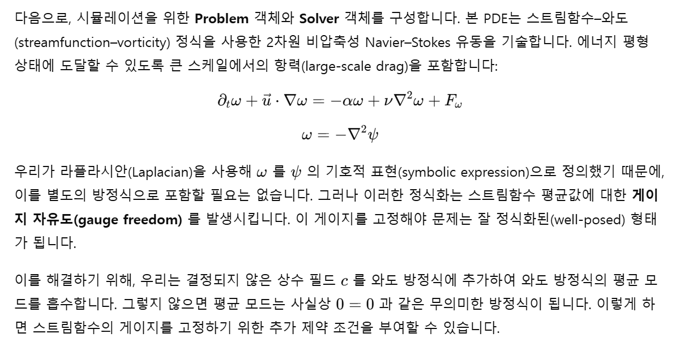

# Another dedalus project 2

# **Forcing and Analysis - 2D Turbulence**

**개요(Overview):**

이 노트북은 강제된 2차원 난류 시뮬레이션을 구성하고 그 결과를 분석하는 방법을 설명합니다.

**Dedalus 소개(About Dedalus):**

Dedalus는 전역 스펙트럴 방법을 사용해 편미분방정식(PDE)을 푸는 오픈 소스 파이썬 패키지입니다. 이 방법은 상자나 구와 같은 단순한 영역에서 매끄러운 해를 갖는 PDE를 매우 정확하게 수치적으로 해결할 수 있게 합니다. Dedalus는 희소 다항식 기반의 최신 병렬 알고리즘을 통합하고 있으며, 이를 직관적인 기호(symbolic) 인터페이스로 제공합니다. 이 코드는 다양한 분야에서 널리 활용되고 있으며, 특히 유체 역학과 관련된 문제들에서 많이 사용됩니다.

```
%matplotlib widget

import numpy as np
np.seterr(over="raise")

import matplotlib.pyplot as plt

import dedalus.public as d3

root_logger = logging.getLogger()
if root_logger.handlers:
    for handler in root_logger.handlers:
        root_logger.removeHandler(handler)

# import logging
logger = logging.getLogger(__name__)
```

## **1. Setup domain and fields**

우리는 강제된 2차원 난류 시뮬레이션을 위한 영역(domain)을 설정하는 것부터 시작합니다. 영역으로는 각 차원에  L=2πL = 2\piL=2π  크기를 갖는 이중 주기적 박스(doubly-periodic box)를 사용하며, 각 차원은  NNN  개의 푸리에(Fourier) 모드로 이산화합니다.

먼저 데카르트 좌표계를 생성한 뒤, Distributor 객체를 만들고, 마지막으로 각 차원에 대해 RealFourier 기반(basis)을 정의합니다. 우리는 2차 비선형성을 갖는 Navier–Stokes 방정식을 풀 것이므로, 딜리아싱(dealiasing) 비율은 3/2로 선택합니다.

```
# Domain parameters
L = 2 *np.pi
N = 512
mesh = None
dtype = np.float64
dealias = 3 /2

# Domain
coords = d3.CartesianCoordinates('x', 'y')
dist = d3.Distributor(coords, mesh=mesh, dtype=dtype)
xbasis = d3.RealFourier(coords[0], N, bounds=(0, L), dealias=dealias)
ybasis = d3.RealFourier(coords[1], N, bounds=(0, L), dealias=dealias)
```

다음으로, 시뮬레이션에 필요한 필드를 생성합니다. 비압축성 2차원 유동의 경우, 스트림함수–와도(streamfunction–vorticity) 정식을 사용하면 비압축성 조건을 더 간단하게 만족시킬 수 있고 계산도 더 빠르게 수행할 수 있습니다. 이 접근법에서는 스트림함수 ψ\psiψ 만을 해석해야 할 변수 필드로 정의하면 됩니다. 또한 스트림함수–와도 정식에서 게이지 자유도(gauge freedom)를 설정하기 위해 사용할 상수 필드 ccc 도 생성합니다.

```
# Fields
psi = dist.Field(name='psi', bases=(xbasis, ybasis))
c = dist.Field(name='c')
```

우리는 속도나 와도를 나타내기 위한 추가 필드를 정의할 필요가 없습니다. 이러한 물리량은 Dedalus가 제공하는 벡터 미적분 연산자를 사용하여 스트림함수에 기반한 기호 표현(symbolic expression)만으로 완전히 표현할 수 있습니다. 이 접근법은 방정식의 정의뿐만 아니라 이후 분석 작업도 단순화해 줍니다

```
# Substitutions
u = -d3.skew(d3.grad(psi))  # velocity vector: [dy(psi), -dx(psi)]
w = -d3.lap(psi)            # vorticity: dx(uy) -dy(ux)
e = (u @u) /2               # energy density
z = (w *w) /2               # enstrophy density
```

## **2. Stochastic forcing**

통계적으로 정상적인 난류 상태(statistically steady turbulent state)를 얻기 위해, 우리는 특정 에너지 주입률이 주어진 확률적(stochastic) 밴드 제한(band-limited) 강제력을 사용합니다. 먼저 에너지 주입률, 주요 파수(primary wavenumber), 그리고 확률적 강제력의 대역폭을 지정합니다. 그런 다음 반복(iteration)마다 새로운 무작위 강제력이 갱신되도록 하는 필드 FwF_wFw 를 생성하고, 이를 업데이트하는 함수를 정의합니다.

이러한 형태의 강제력을 정확히 정규화(normalization)하는 과정은 까다로울 수 있지만, 에너지 주입률을 정확하게 제어하기 위해 매우 중요합니다. 여기서는 푸리에 공간(Fourier space)에서 특정 반지름 영역(ring)에 집중된 지지(support)를 갖는 정규화된 가우시안 무작위 필드를 생성합니다. 또한 확률적 적분기(stochastic integrator)에 필요한 방식으로 시간 스텝(timestep)에 따라 이 강제력을 스케일링하고, FwF_wFw 필드의 계수를 설정하는 함수도 정의합니다.

```
# Forcing parameters
epsilon = 1     # Energy injection rate
kf = 50         # Forcing wavenumber
kfw = 2         # Forcing bandwidth
seed = None     # Random seed

# Derived parameters
eta = epsilon *kf**2  # Enstrophy injection rate

# Forcing field and derived parameters
Fw = dist.Field(name='Fw', bases=(xbasis, ybasis))
kx = xbasis.wavenumbers[dist.local_modes(xbasis)]
ky = ybasis.wavenumbers[dist.local_modes(ybasis)]
dkx = dky = 2 *np.pi /L

# Forcing function
rand = np.random.RandomState(seed)

def draw_gaussian_random_field():
    """
    Create Gaussian random field concentrating on a ring in Fourier space with unit variance.
    """
    k = (kx**2 +ky**2)**0.5

    # 1D power spectrum: normalized Gaussian, no mean
    P1 = np.exp(-(k -kf)**2 /2 /kfw**2) /np.sqrt(kfw**2 *np.pi /2) *(k != 0)

    # 2D power spectrum: divide by polar Jacobian
    P2 = P1 /2 /np.pi /(k +(k==0))

    # 2D coefficient poewr spectrum: divide by mode power
    Pc = P2 /2**((kx == 0).astype(float) +(ky == 0).astype(float) -2)

    # Forcing amplitude, including division between sine and cosine
    f_amp = (Pc /2 *dkx *dkx)**0.5

    # Forcing with random phase
    f = f_amp *rand.randn(*k.shape)

    return f

def set_vorticity_forcing(timestep):
    """
    Set vorticity forcing field from scaled Gaussian random field.
    """
    # Set forcing to normalized Gaussian random field
    Fw['c'] = draw_gaussian_random_field()

    # Rescale by forcing rate, including factor for 1/2 in kinetic energy
    Fw['c'] *= (2 *eta /timestep)**0.5
```

## **3. Build problem and solver**



```
# Problem parameters
L_diss = L /N   # Dissipation scale
L_fric = L      # Friction scale

# Derived parameters
nu = L_diss**2 *eta**(1/3)               # Viscosity
alpha = epsilon**(1/3) *L_fric**(-2/3)   # Friction

# Problem
problem = d3.IVP([psi, c], namespace=locals())
problem.add_equation("dt(w) -nu *lap(w) +alpha *w +c = -u @grad(w) +Fw")
problem.add_equation("integ(psi) = 0");
```

```
# Solver parameters
timestepper = d3.RK222
stop_sim_time = 5

# Solver
solver = problem.build_solver(timestepper)
solver.stop_sim_time = stop_sim_time
```

## **4. Analysis tasks**

**분석 핸들러(Analysis Handlers)**

시간 적분(time-stepping) 동안 분석 작업의 명시적 계산은 `solver.evaluator` 객체가 관리합니다. 이 evaluator에는 다양한 핸들러(handler) 객체를 연결할 수 있으며, 각 핸들러는 작업이 언제 계산되고 어떻게 처리될지를 결정합니다.

시뮬레이션 분석에 가장 유용한 핸들러는 **FileHandler**로, 주기적으로 작업을 평가하고 그 결과를 HDF5 파일로 기록합니다.

### **FileHandler 설정**

파일 핸들러를 설정할 때는 다음을 지정합니다:

- 출력 디렉터리 또는 파일의 이름/경로
- 핸들러가 작업을 평가할 주기(cadence)

이 주기는 다음 기준들의 조합으로 설정할 수 있습니다:

- 시뮬레이션 시간 (`sim_dt`)
- 실제 경과 시간 (`wall_dt`)
- 반복 횟수 (`iter`)

파일 크기를 제한하기 위해, 파일 핸들러의 출력은 여러 “셋(set)”으로 나누어 저장되며 각 셋에는 고정된 횟수의 기록이 포함됩니다. 이 제한은 파일 핸들러 생성 시 `max_writes` 키워드로 설정할 수 있습니다.

서로 다른 주기로 서로 다른 작업을 기록하기 위해 여러 개의 파일 핸들러를 추가할 수도 있습니다.

```
# Analysis parameters
snapshots_dt = 0.1
scalars_dt = 0.01

# Analysis
snapshots = solver.evaluator.add_file_handler('snapshots', sim_dt=snapshots_dt, max_writes=1, mode='overwrite')
snapshots.add_task(psi, name='psi')
snapshots.add_task(w, name='vorticity')

scalars = solver.evaluator.add_file_handler('scalars', sim_dt=scalars_dt, mode='overwrite')
ave = d3.Average
scalars.add_task(ave(e), name='E')
scalars.add_task(ave(z), name='Z')
scalars.add_task(ave(-alpha *2 *e), name='E friction')
scalars.add_task(ave(-alpha *2 *z), name='Z friction')
scalars.add_task(ave(nu *u @d3.lap(u)), name='E viscosity')
scalars.add_task(ave(nu *w *d3.lap(w)), name='Z viscosity')
```

## **5. Adaptive timestepping and main loop**

보다 복잡한 시뮬레이션에서는 **고정된 시간 스텝(timestep)** 을 사용하는 것이 지나치게 제한적일 수 있습니다. 이러한 경우 **CFL 조건**에 기반하여 시간 스텝을 **적응적으로(adaptively)** 선택하는 것이 더 바람직합니다. Dedalus는 이를 위한 CFL 도구를 제공하며, 여러 가지 선택적 파라미터를 통해 불필요한 시간 스텝 변화(계산 비용을 증가시킬 수 있음)를 피하고 시간 스텝을 적절한 범위 내에서 유지할 수 있도록 합니다.

아래는 예상 RMS 속도에 대한 추정치를 기반으로 CFL 조건을 설정하는 예제이며, CFL 옵션을 위한 일반적인 파라미터 선택도 함께 포함되어 있습니다:

```
# Timestepping parameters
dx = L /N                           # Grid spacing
U = epsilon**(1/3) *L_fric**(1/3)   # Friction velocity
safety = 0.5                        # CFL safety factor
max_dt = safety *dx /U              # Timestep

# CFL
CFL = d3.CFL(solver, initial_dt=max_dt, cadence=10, safety=safety, max_change=1.5, min_change=0.5, max_dt=max_dt, threshold=0.05)
CFL.add_velocity(u)
```

이제 이전 튜토리얼과 동일한 방식으로 시뮬레이션을 실행할 수 있지만, 메인 루프 동안 데이터를 수동으로 저장할 필요는 없습니다. 시뮬레이션이 진행되는 동안 evaluator가 지정된 분석 작업을 선택된 주기에 따라 자동으로 계산하고 저장합니다.

각 반복(iteration)마다 먼저 `CFL.compute_timestep` 메서드를 사용해 새로운 시간 스텝을 계산합니다. 그런 다음 무작위 강제력을 갱신하고, 계산된 시간 스텝을 사용해 시뮬레이션을 한 스텝 전진시킵니다. 마지막으로 시뮬레이션이 완료되면 `solver.log_stats()`를 사용해 일반적인 실행 통계를 출력할 수 있습니다.

```
# Main loop
try:
    logger.info('Starting loop')
    while solver.proceed:
        timestep = CFL.compute_timestep()
        set_vorticity_forcing(timestep)
        solver.step(timestep)
        if (solver.iteration -1) % 10 == 0:
            logger.info(f'Iteration={solver.iteration:4d}, Time={solver.sim_time:e}, dt={timestep}')
except:
    logger.error('Exception raised, triggering end of main loop.')
    raise
finally:
    solver.log_stats()
```

## **6. Post-processing**

기본적으로, 각 파일 핸들러가 생성하는 출력 파일은 다음과 같은 구조로 정리됩니다:

1. **기본 폴더(base folder)**
    
    파일 핸들러를 생성할 때 지정한 문자열을 이름으로 갖는 폴더가 만들어집니다
    
    (예: `scalars/`).
    
2. **출력 세트별 HDF5 파일**
    
    기본 폴더 안에는 각 출력 세트(output set)에 대해 HDF5 파일이 생성되며,
    
    파일 이름은 기본 이름에 세트 번호를 붙여 구성됩니다
    
    (예: `scalars_s1.h5`).
    
3. **tasks 그룹**
    
    각 HDF5 파일에는 `tasks` 그룹이 포함되어 있으며,
    
    파일 핸들러에 등록된 각 작업(task)에 대해 하나의 데이터셋이 저장됩니다.
    
    - 각 데이터셋의 **첫 번째 차원은 시간(time)** 에 해당합니다.
    - 이후의 차원들은 (해당되는 경우) 작업의 벡터 또는 텐서 성분을 나타내며,
        
        그 다음으로 공간 차원(spatial dimensions)이 옵니다.
        

HDF5 데이터셋은 모두 **자기 기술적(self-describing)** 구조를 갖습니다.

즉, 각 축(axis)에 적절한 차원 스케일(dimensional scale)이 붙어 있습니다.

- **시간 축(time axis)** 에는 시뮬레이션 시간, 실제 경과 시간(wall time), 반복 횟수(iteration), 기록 번호(write number)가 포함됩니다.
- **공간 축(spatial axes)** 에는 작업의 레이아웃(layout)에 따라 격자점(grid points) 혹은 모드(modes)가 대응됩니다.

예시로, 첫 번째 scalar 세트 파일을 열어 **평균 운동 에너지(kinetic energy)와 엔스트로피(enstrophy)** 의 시계열을 플롯해보겠습니다:

```
import h5py

# Load energy and enstrophy traces
scalars = h5py.File('scalars/scalars_s1.h5', mode='r')
E = scalars['tasks']['E'][:]
Z = scalars['tasks']['Z'][:]
t = scalars['tasks']['E'].dims[0]['sim_time'][:]

# Plot data
plt.figure()

plt.plot(t, E.ravel(), '.-', label=r'$E$')
plt.plot(t, Z.ravel() /kf**2, '.-', label=r'$Z /k_f^2$')

plt.xlabel('t')
plt.legend()
plt.tight_layout()
```

```
# Load energy and enstrophy traces
snapshots = h5py.File('snapshots/snapshots_s2.h5', mode='r')
psi = snapshots['tasks']['psi'][:]
w = snapshots['tasks']['vorticity'][:]
x = snapshots['tasks']['vorticity'].dims[1]['x'][:]
y = snapshots['tasks']['vorticity'].dims[2]['y'][:]

# Plot data
clim = np.max(np.abs(w[-1]))

plt.figure()

plt.pcolormesh(x, y, w[-1], cmap='RdBu_r', clim=(-clim, clim))
plt.axis('scaled')
plt.colorbar()
plt.title('Vorticity')
plt.tight_layout()
```

마지막으로, 해(solution)의 **파워 스펙트럼(power spectrum)** 을 플로팅해보겠습니다.

이는 두 가지 방식으로 수행할 수 있습니다:

1. **Dedalus에서 직접 계수 공간(coefficient-space) 데이터를 저장하는 방법**
    
    (`add_task` 메서드에 `layout='c'` 옵션을 전달)
    
2. **NumPy FFT를 사용하여 격자 공간(grid-space) 데이터를 복소 계수(complex coefficients)로 변환하는 방법**

여기서는 두 번째 방법을 사용하겠습니다.

다만, **정상화(normalization)** 에 주의해야 합니다.

NumPy FFT와 Dedalus FFT는 서로 다른 방식으로 정규화되므로,

진폭(amplitude)을 정확히 구하려면 이를 고려해야 합니다.

```
# Setup frequency bins
kx = np.fft.fftfreq(N, 1/N)[:, None]
ky = np.fft.fftfreq(N, 1/N)[None, :]
k = (kx**2 +ky**2)**0.5
kmax = int(np.ceil(np.max(k)))

bins = np.arange(1, kmax +1, 2)
kcen = bins[:-1] +np.diff(bins) /2

# Use renormalized numpy FFT to compute power spectrum
E_k2 = np.abs(np.fft.fft2(psi[-1]) /N**2)**2 *k**2
E_k1 = E_k2 *2 *np.pi *k

# Build histogram over modes, weighted by energy
pow_samples, _ = np.histogram(k, bins=bins, weights=E_k1)
hist_samples, _ = np.histogram(k, bins=bins)
spectrum = pow_samples /hist_samples /2

# Plot histogram
plt.figure()

plt.loglog(kcen, epsilon**(2/3) *kcen**(-5/3), '--k')
plt.loglog(kcen, eta**(2/3) *kcen**(-3), '--k')
plt.loglog(kcen, spectrum, '.-')

plt.xlabel("k")
plt.ylabel("E(k)")
plt.tight_layout()
```
