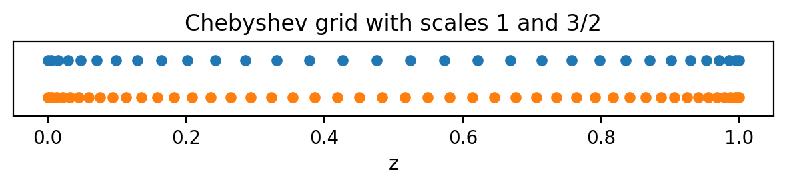
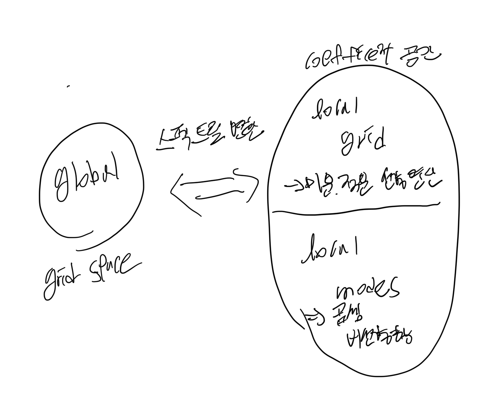

# DEDALUS 튜토리얼 1

# OVERVIEW

-좌표 기저 분배 객체를 다루는 기본적인 방법을 소개 

-스펙트럴 분해법을 사용하여 field를 표현하고 PDE를 푼다 

1. 문제의 공간 좌표를 정의 
2. 각 좌표에 적합한 스펙트럴 기저를 선택
3. 선택한 좌표 집합을 바탕으로 분배기를 생성

### 스펙트럴 분해법이란?

어떤 함수를 직접 격자점 위에서 다루는 대신 그 함수의 기저 함수들의 조합으로 표현해서 쓰는 방법

즉, 선형대수학에서 e1 e2 기저를 활용하여 좌표를 표현하는 것과 같은 의미(기저 벡터들의 선형 결합)

# 1.1 Coordinates

coordinate: 한개 공간 좌표를 정의할때 사용, 주로 1차원에서 사용

coordinateSystem: 여러 좌표를 묶어서 다차원 공간을 표현. Deadalus에는 기본적인 여러가지 좌표계가 존재

CartesianCoordinates-직교좌표계

PolarCoordinates-극좌표계(방위각 반지름)

S2Coordinates-2차원 구면좌표계

SphericalCoordinates-3차원 구면 좌표계

좌표계 이름 지정 방법 

좌표계를 만들때는 좌표이름을 순서대로 지정해야 함 
`coords = d3.CartesianCoordinates('x', 'y', 'z')직교좌표계 예시`

# 1.2 Distributors

Distributors 객체는 PDE 풀이를 위해 필요한 필드와 문제를 병렬로 분해 및 배치하는 역할

`dist = d3.Distributor(coords, dtype=np.float64) # No mesh for serial / automatic parallelization`

1. 좌표계 타입 설정
2. 데이터 타입 설정
3. 병렬화를 위한 프로세스 메쉬 설정

-mesh는 각각의 축을 몇개의 프로세스로 나눌것인지를 말함

-mesh를 설정하지 않으면 자동으로 최적의 분할을 선택

### Parallelization & process meshes

### MPI란?

병렬계산 라이브러리에서 병렬 실행을 가능하게 해주는 기반 환경 

여러개의 CPU들이 협력할수 있게 도와주는 라이브러리 

Dedalus는 MPI 환경에서 실행될때, 도메인 분할 방식으로 계산한다.

slab분해는 한 차원으로 쪼개는 방식을 말함

펜슬 분해는 mesh를 지정함으로서 사용 두차원으로 쪼개는 방식

조건: MPI 프로세스 수=mesh shape 곱

- Mesh dimension ≤ 분리 가능한 좌표 개수
- 주기적 좌표나 각도 좌표에서는 분리가 가능하므로 병렬화가 가능
- 특수한 경우 완전히 분리가능(구 시뮬레이션에서) mesh demension< 전체 차원

### Layout

Distributor의 역할

- 병렬 계산을 위한 핵심도구
- 필드 데이터를 여러 프로세스에 나누어 배치
- 스펙트럴 변환(coefficient-grid space)을 위한 데이터의 변환 분포 상태 설명하는 Layout 객체의 순서 집합이 포함

일반적인 알고리즘은 coefficient space에서 시작하며, 이때 마지막 축은 로컬 상태이다. 그런 다음 마지막 축을 격자공간으로 변환하여 레이아웃 1에 도달한다. 이후 데이터를 전역적으로 전치하여 끝에서 두번째 축이 로컬이 되도록 만든다. 그 축을 격자공간으로 변환하고, 이 과정을 반복하여 모든 축이 격자 공간으로 변환 될때까지 진행한다. 마지막 단계에서 도달하는 레이아웃이 최종 레이아웃이다.

전치란- 차원의 순서를 바꾸는거

변환-스펙트럴 역변환

직렬계산의 과정에서는 필요하지 않다.(모든 축이 한 프로세스 안에 있기 때문에)

`# Don't do this. For illustration only.
dist.mesh = np.array([4, 2])
dist.comm_coords = np.array([0, 0])
dist._build_layouts(dry_run=True)`

`for layout in dist.layouts:
    print('Layout {}:  Grid space: {}  Local: {}'.format(layout.index, layout.grid_space, layout.local))`

`Layout 0:  Grid space: [False False False]  Local: [False False  True]
Layout 1:  Grid space: [False False  True]  Local: [False False  True]
Layout 2:  Grid space: [False False  True]  Local: [False  True False]
Layout 3:  Grid space: [False  True  True]  Local: [False  True False]
Layout 4:  Grid space: [False  True  True]  Local: [ True False False]
Layout 5:  Grid space: [ True  True  True]  Local: [ True False False]`

Layout: 데이터가 현재 어떤 상태로 저장 및 분배되어 있는지 설명하는 객체

-레이아웃 객체를 직접 다룰 필요는 없지만, 데이터의 분포와 변환 상태를 제어하는 이 시스템을 이해하고 있는 것은 중요하다. 

좌표공간: 실제 물리 좌표에서 보이는 값을 저장하는 공간

계수공간: 스펙트럴  기저 함수에 의해 계수로 표현한 공간,미분이나 적분 퓨리에 계수처럼 특수한 상황에서 표현하기 용이 

- **Local=True**: 이 rank가 해당 축 데이터 전체를 갖고 있어서 연산(예: FFT, 미분) 가능.
- **Local=False**: 그 축 데이터는 분산돼 있어서 직접 연산 불가능 → 통신 후 다른 Layout으로 바꿔야 함.

# 1.3 Bases

### Creating a basis

이 클래스들은 해당 스펙트럴 연산자를 정의 할뿐만 아니라, 그 기저에서 함수 격자 공간 표현과 계수공간 표현 사이의 변환도 정의한다.

- `RealFourier` for real periodic functions on an interval using cosine & sine modes. 실수 주기적 함수 표현
- `ComplexFourier` for complex periodic functions on an interval using complex exponentials. 복소수 주기적 함수
- `Chebyshev` for functions on an interval. 경계층 문제나 비주기적 함수
- `Jacobi` for functions on an interval under a more general inner product (usually `Chebyshev` is best for performance). 구간에 정의된 함수 표현
- `DiskBasis` for functions on a full disk in polar coordinates.
- 극좌표계에서 원판 위의 함수 표현
- `AnnulusBasis` for functions on an annulus in polar coordinates. 극좌표계에서 환영 위의 함수 표현
- `SphereBasis` for functions on the 2-sphere in S2 or spherical coordinates. 구좌표계 또는 위의 구면 함수 표현
- `BallBasis` for functions on a full ball in spherical coordinates. 구 좌표계에서 구 내부의 함수 표현
- `ShellBasis` for functions on a spherical shell in spherical coordinates. 구 좌표계에서 구껍질 위의 함수 표현

1차원/ 직교 좌표 기저 생성 방법

- 해당하는 좌표 객체
- 기저 모드의 개수
- 기저 구간의 좌표 경계

다차원/곡선 좌표 기저 생성 방법

- 해당하는 좌표계
- 기저의 다차원 모드 형태
- 기저의 반경 범위
- 문제의 데이터 타입

### Dealiasing 방법

문제 배경: 스펙트럴 방법에서 비선형 항을 다룰때 생기는 현상

격자는 한정된 모드까지만 표현 하지만, 그 이상의 주파수가 생기면 잘못된값이 낮은 주파수에 섞여 들어가 오류 발생

이를 막기 위해, 그리드로 변환할때 모드 수를 늘려서(패딩) 계산

```
xbasis = d3.RealFourier(coords['x'], size=32, bounds=(0,1), dealias=3/2)
ybasis = d3.RealFourier(coords['y'], size=32, bounds=(0,1), dealias=3/2)
zbasis = d3.Chebyshev(coords['z'], size=32, bounds=(0,1), dealias=3/2)
```

### 1. `xbasis = d3.RealFourier(coords['x'], size=32, bounds=(0,1), dealias=3/2)`

- **기저(basis):** `RealFourier` → 실수(real) 주기적 함수 표현 (사인/코사인 모드).
- **좌표:** `coords['x']` → x 방향 좌표를 사용.
- **size=32:** x 방향에서 32개 모드(주파수 성분)를 사용.
- **bounds=(0,1):** x 구간은 [0,1].
- **dealias=3/2:** 비선형 항 계산 시 aliasing을 피하기 위해, FFT 변환 시 모드 수를 1.5배로 늘려 사용.

👉 즉, “x축을 [0,1] 구간에서 32개 Fourier 모드로 표현하되, 비선형 안정성을 위해 1.5배 확장해서 계산한다”는 뜻.

### Basis grids and scale factors

global grid를 활용하면 선택적으로 스케일 인자를 받을수 있다. 이는 격자점의 수를 기저 모드의 수에 대해 상대적으로 결정한다.

체비셰프 격자를 살펴볼때, 스케일인자와 1인경우 와 1.5인경우 비교 



```
grid_normal = zbasis.global_grid(dist, scale=1).ravel()
grid_dealias = zbasis.global_grid(dist, scale=3/2).ravel()

plt.figure(figsize=(6, 1.5), dpi=100)
plt.plot(grid_normal, 0*grid_normal+1, 'o', markersize=5)
plt.plot(grid_dealias, 0*grid_dealias-1, 'o', markersize=5)
plt.xlabel('z')
plt.title('Chebyshev grid with scales 1 and 3/2')
plt.ylim([-2, 2])
plt.gca().yaxis.set_ticks([]);
plt.tight_layout()
```

-scale을 높이면 격자점의 개수가 증가

scale 개수 증가시

-비선형 연산시 새로운 성분이 생기는데 원래 격자만 쓰면 잘못 folding 되어 aliasing 문제점 생김

즉, 개수를 늘려서 안정화시킨후 잘라냄

scale 개수 감소시 

-데이터 간력화 및 시각화 할때 용이

### **Distributed grid and element arrays**

-필드 데이터를 생성하기 위한 distributors는 좌표 그리드와 mode 넘버의 지역 부분을 제공

### LOCAL GRIID (좌표공간에서)의 특징

-지역 그리드는 dist.local_grid 메서드를 이용해 접근 가능

-기저와 스케일 계수는 1을 지정

`local_x = dist.local_grid(xbasis)
local_y = dist.local_grid(ybasis)
local_z = dist.local_grid(zbasis)
print('Local x shape:', local_x.shape)
print('Local y shape:', local_y.shape)
print('Local z shape:', local_z.shape)`

결과 값

`Local x shape: (32, 1, 1)
Local y shape: (1, 8, 1)
Local z shape: (1, 1, 16)`

x축이 퓨리에 기저를 사용하는 경우

- **x축 격자:** 모든 프로세스가 동일한 전체 격자를 공유
- **y, z축 격자:** 프로세스마다 다른 부분(local grid)을 갖게 되며, 분산 메쉬에 따라 나누어짐

### LOCAL MODE의 특징(계수공간에서 )

지역모드는 dist.local_modes 메서드 사용하여 기저 지정 및 접근

`local_kx = dist.local_modes(xbasis)
local_ky = dist.local_modes(ybasis)
local_nz = dist.local_modes(zbasis)
print('Local kx shape:', local_kx.shape)
print('Local ky shape:', local_ky.shape)
print('Local nz shape:', local_nz.shape)`

결과 값

`Local kx shape: (8, 1, 1)
Local ky shape: (1, 16, 1)
Local nz shape: (1, 1, 32)`

- `dist.local_modes(basis)`

각 축의 기저에 따라, 해당 프로세스가 담당하는 지역 모드 배열을 반환

---

---

`al kx shape: (8, 1, 1)`

`---x축 방향으로 8개의 모드, y와z축은 1씩있음`

`Local ky shape: (1, 16, 1)`

`---y축 방향으로 16개의 모드, x와z축은 1씩 있음`

`Local nz shape: (1, 1, 32)`

---

즉, 3차원 계수 공간에서 특정 축에 해당하는 지역 모드 배열을 의미

- local kx와 local ky 요소들은 프로세스마다 달라지는데, 이는 이들이 계수 공간에서 분산된 x와 y 파수의 지역부분만 포함하기 때문이다.
- 반면, locla kz 요소들은 체비셰프(Chebyshev) 모드 전체를 포함하며, 이는 계수 공간에서 항상 지역이다,모든 프로세스 공유

이처럼 지역 배열은 격자 공간이나 계수 공간에서 병렬 계산에 안전한 초기 조건을 만드는데 사용된다.

-수평(xy): 무한히 넓고 주기적한 영역

-수직: 경계가 있는 영역

보통 유체역학 열전달 문제를 풀기 위해서 사용


