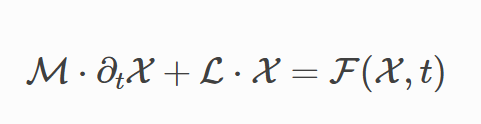

# DEDALUS 튜토리얼 3

## **Tutorial 3: Problems and Solvers**

Overview: deldalus를 사용하여 기본적인 세팅 법과 문제의 해를 구하는 법을 배울 것. dedalus는 기호적으로 지정된 초깃값 문제 경계값 문제 그리고 고윳값 문제를 푸는 도구 

### **3.1: Problems**

**Problem formulations**

- Dedalus 는 기호적으로 정의된 방정식들과 경계 조건을 받아, 모든 초기 값 문제를 하나적인 표준 형태로 변환



-L과 M은 선형 미분 연산자로 구성된 행렬

-X는 알려지지 않은 필드의 상태 벡터

-F는 비선형 항을 포함하는 벡터

1. prognostic/evoulution 방정식-시간 미분항을 포함하는 방정식
2. diagnostic/algebraic 제약식-시간 미분항이 없는  방정식

이는 도메인의 내부와 경계 모두에서 적용

-좌변은 시간 미분에 대해 1차, 문제 변수에 대해 선형 이어야 함

-우변은 아마 비선형, 시간 의존 텀이 필요함 다만, 시간 미분항은 불가

이러한 제약은 dedalus가 내부적으로 선형 연산자 분해와 시간 적분을 효율적으로 가능하게 해줌

게다가 초깃값 문제에 대해, 일반화된 고윳값 문제와 선형 경계 문제, 비선형 경계 문제를 위한 표준형태가 있다. 이러한 4문제 종류는 he `IVP`, `EVP`, `LBVP`, and `NLBVP` problem classes, 라는 클래스로 표현

**Problem initialization**

-problem object를 만들기 위해 필드 변수들의 리스트를 생성해야함

-문제 객체를 생성 할때, namespace 인자를 통해 딕셔너리를 전달 할수 있다.

-Dedalus가 나중에 방정식을 해석할때, 그 딕셔너리에 포함된 연산자나 함수를 포함 할수 있다.

즉, Deldalus가 나중에 add_equation()을 읽을때 namespace 안에 들어 있는 이름들은 참조 할 수있다.

일반적으로 `locals()`를 전달하는 것이 권장
-problem 객체 내부에서 스크립트 코드에서 정의한 모든 변수와 함수가 인식 가능

the complex Ginzburg-Landau equation (CGLE) 


따라서, 우리는 구간 x를 체비셰프 기저로 이산화 하고, 세제곱 비선형 항을 올바르게 디앨리싱 하기 위해 디앨리싱 계수를 2로 선택

현재 버전의 dedalus에서는 경계조건을 강제하기 위해 tau항을 명시적으로 문제의 미지수로 추가 해야함

이 문제는 구간의 양 끝 점에서 두개의 경계 조건을 만족시켜야 하므로, 이를 강제하기 위해 두개의 상수 tau항이 필요

```
# Bases
xcoord = d3.Coordinate('x')
dist = d3.Distributor(xcoord, dtype=np.complex128)
xbasis = d3.Chebyshev(xcoord, 1024, bounds=(0, 300), dealias=2)

# Fields
u = dist.Field(name='u', bases=xbasis)
tau1 = dist.Field(name='tau1')
tau2 = dist.Field(name='tau2')

# Problem
problem = d3.IVP([u, tau1, tau2], namespace=locals())
```

-기저, 필드, problem 설정

**Substitutions**

문제 내에서 변수 외에 객체를 사용하는 방법, 즉 substitution에 대해 알아보자 

외력이나 편미분 방정식의 비상수 계수를 정의하는 다른 필드들이 존재

좌변에 등장하는 비상수 계수들은 자신이 정의된 기저를 갖는 차원들 사이를 서로 결합하므로 비상수 계수 필드를 생성할때는 비상수인 차원에 대해서만 기저를 사용해야한다는 점이 중요

우리는 여기서 비상수 계수나 주기적 차원은 다루지 않지만, 그 과정을 간단히 살펴보자 

가령, x 방향은 퓨리에 y방향은 사인 코사인 z 방향은 쳬비셰프 기저를 사용하는 3차원 문제를 생각하자 

이 경우 z 방향에서 단순한 비상수 계수를 문제에  추가하려면 

```
#ncc = dist.Field(bases=zbasis)
#ncc['g'] = z**2
```

필드를 설정하고 격자 공간에 직접적으로 지정

대체(substitution)는 또한 **문제 변수로부터 계산된 연산자(operator)** 나,

**방정식을 간결하게 입력하기 위한 보조 함수(helper functions)** 를 **별칭(alias)** 형태로 정의할 수도 있다.

예를 들어, 여기서는 다음과 같은 단순한 대체 정의들을 만들어볼 것이다:

- **`Differentiate` 연산자**를 간단히 호출할 수 있도록 하는 별칭,
- **필드 uuu** 의 **제곱 크기(|u|²)** 를 계산하는 별칭,
- PDE 안에 사용되는 **매개변수(예: α, β 등)** 정의,
- 그리고 **τ 다항식(tau polynomials)** 정의 (자세한 내용은 *Tau Method* 페이지 참고).

즉, 이런 대체(substitution)들은 **방정식 입력을 단순화하고, 반복적인 코드 작성을 줄이기 위한 편의 기능**으로 사용된다.

```
# Substitutions
dx = lambda A: d3.Differentiate(A, xcoord)
magsq_u = u * np.conj(u)
b = 0.5
c = -1.76

# Tau polynomials
tau_basis = xbasis.derivative_basis(2)
p1 = dist.Field(bases=tau_basis)
p2 = dist.Field(bases=tau_basis)
p1['c'][-1] = 1
p2['c'][-2] = 2
```

1. lambda A:는 익명 함수 정의 방식으로, A를 인자로 받아 x 방향으로 미분합니다.

즉, 나중에 dx(u)라고 쓰면
→ d3.Differentiate(u, xcoord)와 같은 의미입니다.

1. u의 복소수 절대값의 제곱을 미리계산하는 함수

**Equation entry**

방정식은 연산자 표현의 쌍으로 (LHS, RHS) , “LHS=RHS” 같은 문자열 형태 가능

namespace로 넘겨준 substitution들 뿐만아니라 문자열로 입력할때는 Dedalus가 기본적으로 제공하는 내장연산자들과 축약형도 인식 가능

```
# Add main equation, with linear terms on the LHS and nonlinear terms on the RHS
problem.add_equation("dt(u) - u - (1 + 1j*b)*dx(dx(u)) + tau1*p1 + tau2*p2 = - (1 + 1j*c) * magsq_u * u")

# Add boundary conditions
problem.add_equation("u(x='left') = 0")
problem.add_equation("u(x='right') = 0")
```


경계 조건


## **3.2: Solvers**

**Building a solver**

각 문제 유형마다 그 문제를 실제로 푸는 역학을 하는 solver 클래스가 있다. 이 solver는 `problem.build_solver(...)` 메서드를 호출해서 생성가능

IVP의 경우, solver를 만들때 시간 적분 방법을 선택해야 한다. Dedalus에는 여러가지 다단계 방식과 Runge-Kutta 기반 IMEX 시간적분 기법들 존재 

```
# Build solver
solver = problem.build_solver(d3.RK222)
```

### `d3.RK222`

- Dedalus에서 제공하는 **시간 적분법(timestepping scheme)** 중 하나입니다.
- 이름을 풀면:
    - **RK** → Runge–Kutta 계열
    - **222** → 2차 정확도, 2단계 IMEX(Implicit–Explicit) 스킴

📘 IMEX 스킴은 다음과 같은 장점이 있습니다:

- 선형항(linear terms)은 암시적(implicit)으로 계산 → 안정성 높음
- 비선형항(nonlinear terms)은 명시적(explicit)으로 계산 → 효율성 높음

즉, Dedalus가 **안정성과 계산 속도 사이의 균형**을 유지하며 PDE를 시간에 따라 발전시킬 수 있게 해줍니다.

**Setting stop criteria**

초기값 문제의 경우, 시뮬레이션을 언제 멈출지(정지 조건)을 설정 할수 있다.

- **`solver.stop_iteration`** → 반복(step)의 개수가 이 값에 도달하면 중지
- **`solver.stop_wall_time`** → 실제 계산 시간(초 단위, 시뮬레이션 시작 이후 경과 시간)이 이 값을 넘으면 중지
- **`solver.stop_sim_time`** → 시뮬레이션상의 시간(물리적 또는 계산 단위)이 이 값에 도달하면 중지

**Setting initial conditions** 

초깃값 문제 와 비선형 경계 조건 문제의 경우, 초기 조건은 시뮬레이션을 시작하기 전에 상태 변수의 데이터를 직접 수정하여 설정

```
x = dist.local_grid(xbasis)
u['g'] = 1e-3 * np.sin(5 * np.pi * x / 300)
```


초기 조건이라 t=0

**Solving/iterating a problem**

-초기값 문제는 solver.step  메서드를 사용하여 주어진 시간으로 반복

-고유값 문제는 solver.solve_dense 또는 solver.solve_sprase 메서드를 사용

-선형 경계값 문제는 solver.solve 메서드를 사용하여 해결

-비선형 경계값 문제는 solver.newton_iteration 메서드를 사용하여 반복

-Dedalus 초기값 시뮬레이션의 메인 루프를 제어하는 로직은 시뮬레이션 스크립트 안에 명시적으로 작성 되어 있음

-solver.proceed 속성은 지정된 정지 조건 중 하나가 충족 괴면 True에서 False 로 변경


```
# Plot solution
plt.figure(figsize=(6, 7), dpi=100)
plt.pcolormesh(x, t_array, np.abs(u_array), shading='nearest')
plt.colorbar()
plt.xlabel('x')
plt.ylabel('t')
plt.title('Hole-defect chaos in the CGLE: |u|')
plt.tight_layout()
```


