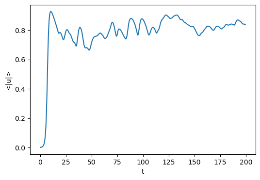

# DEDALUS 튜토리얼4

### OVERVIEW

-이번 장은 Dedalus를 사용한 데이터 분석과 후처리의 기본을 다룬다. 분석 작업은 기호적으로 지정 할 수 있으며, 결과는 분산된 HDF5 파일로 저장 

### 🔹 HDF5란?

- 대용량의 수치 데이터(예: 시뮬레이션 결과, 센서 데이터, 이미지 등)를 **효율적으로 저장**하고 **빠르게 접근**할 수 있도록 만든 파일 형식입니다.
- 파일 내부는 **폴더와 파일 구조(트리 구조)** 로 되어 있어서, 여러 개의 배열이나 데이터셋을 한 파일에 체계적으로 담을 수 있습니다.
    - 마치 ZIP처럼 여러 데이터를 한 곳에 묶지만, 데이터베이스처럼 구조화되어 있어요.

## **4.1: Analysis**

```
# Basis
xcoord = d3.Coordinate('x')
dist = d3.Distributor(xcoord, dtype=np.complex128)
xbasis = d3.Chebyshev(xcoord, 1024, bounds=(0, 300), dealias=2)

# Fields
u = dist.Field(name='u', bases=xbasis)
tau1 = dist.Field(name='tau1')
tau2 = dist.Field(name='tau2')

# Substitutions
dx = lambda A: d3.Differentiate(A, xcoord)
magsq_u = u * np.conj(u)
b = 0.5
c = -1.76

# Tau polynomials
tau_basis = xbasis.derivative_basis(2)
p1 = dist.Field(bases=tau_basis)
p2 = dist.Field(bases=tau_basis)
p1['c'][-1] = 1
p2['c'][-2] = 2

# Problem
problem = d3.IVP([u, tau1, tau2], namespace=locals())
problem.add_equation("dt(u) - u - (1 + 1j*b)*dx(dx(u)) + tau1*p1 + tau2*p2 = - (1 + 1j*c) * magsq_u * u")
problem.add_equation("u(x='left') = 0")
problem.add_equation("u(x='right') = 0")

# Solver
solver = problem.build_solver(d3.RK222)
solver.stop_sim_time = 500

# Initial conditions
x = dist.local_grid(xbasis)
u['g'] = 1e-3 * np.sin(5 * np.pi * x / 300)
```

## **Analysis handlers**

-시간적분 과정에서 분석작업을 명시적으로 수행하는 것은 solver.evaluator 가 제어

-여러 종류의 핸들러 객체를 evalutor가 직접 연결 하며, 이 핸들러들은 언제 작업 직업 계산 할지 어떻게 처리 할지 제시

즉, 분석 데이터 파일로 저장하는 방법을 설명

### ⚙️ `FileHandler` 설정 방법

`FileHandler`를 만들 때는 두 가지를 꼭 지정해야 합니다:

1. 데이터를 저장할 **폴더나 파일의 이름/경로**
2. 데이터를 얼마나 자주 기록할지, 즉 **저장 주기(cadence)**

이 주기는 다음 세 가지 기준 중 하나(또는 여러 개 조합)로 설정할 수 있습니다:

- **시뮬레이션 시간(`sim_dt`)** → 예: 시뮬레이션 시간이 1.0 증가할 때마다 저장
- **실제 실행 시간(`wall_dt`)** → 예: 실제로 30초마다 저장
- **반복 횟수(`iter`)** → 예: 100 스텝마다 저장

### 💾 파일이 너무 커지는 걸 방지하기

시뮬레이션이 길게 진행되면 저장 파일이 너무 커질 수 있기 때문에,

Dedalus는 `FileHandler`가 생성하는 출력을 여러 개의 “세트(sets)”로 나눕니다.

예를 들어:

- 한 세트에는 100번의 기록이 들어 있고,
- `max_writes=100`으로 지정하면 100번 저장할 때마다 새로운 파일 세트를 만들어 나눠 저장합니다.

`analysis = solver.evaluator.add_file_handler('analysis', iter=10, max_writes=400)`

### 🔍 구성요소별 설명

| 구성 요소 | 설명 |
| --- | --- |
| `solver.evaluator` | 시뮬레이션 중 데이터 계산 및 저장을 관리하는 객체입니다. |
| `.add_file_handler('analysis', ...)` | 새로운 **파일 저장 핸들러(FileHandler)** 를 만듭니다. `'analysis'`는 출력 폴더 이름이 됩니다. Dedalus는 자동으로 `analysis_s#.h5` 형태의 HDF5 파일을 생성합니다. |
| `iter=10` | 시뮬레이션 반복(iteration) **10번마다 데이터를 계산 및 저장**합니다. 즉, 10 스텝마다 한 번씩 저장하는 주기 설정입니다. |
| `max_writes=400` | 한 개의 HDF5 파일에 **최대 400번의 저장(write)** 까지만 허용하고, 이후에는 새 파일 세트를 생성합니다. 이 설정은 파일 크기가 너무 커지는 걸 방지합니다. |

## **Analysis tasks**

-분석 작업은 주어진 핸들러에 add_task 메서드를 사용하여 추가

-작업은 연산자 표현 또는 일반 텍스트 형태의 식으로 입력가능

-방정식을 입력 할때 사용한 것과 동일한 namespace를 사용해 해석

- **출력 형식(layout)**,
- **스케일링 계수(scaling factors)**,
- **참조 이름(reference name)**

`analysis.add_task(d3.Integrate(np.sqrt(magsq_u),'x')/300, layout='g', name='<|u|>')`

- `d3.Integrate(np.sqrt(magsq_u), 'x') / 300`
    
    → ∣u∣=u⋅u‾|u| = \sqrt{u \cdot \overline{u}}∣u∣=u⋅u 의 값을 x축 방향으로 적분하고, 전체 길이 300으로 나눠 **평균 진폭(average magnitude)** 을 계산함.
    
- `layout='g'`
    
    → 결과를 **실공간(grid layout)** 에서 계산 및 저장.
    
- `name='<|u|>'`
    
    → 결과를 `<|u|>` 라는 이름으로 HDF5 파일에 저장.
    

즉, 이 코드는 시뮬레이션 중에 **u의 평균 진폭**을 주기적으로 계산하고 파일에 기록하라는 뜻이에요.

체크포인트(checkpoint)를 위해, `add_tasks` 메서드를 사용하여 **모든 상태 변수(state variables)** 를 저장하도록 지정할 수도 있습니다.
`analysis.add_tasks(solver.state, layout='g')`

-과거의 수동 방식이라는 거 다만, 이제는 자동 방식으로 변

```
# Main loop
timestep = 0.05
while solver.proceed:
    solver.step(timestep)
    if solver.iteration % 1000 == 0:
        print('Completed iteration {}'.format(solver.iteration))
```

### 🔹 자동 방식과 비교

나중에 나온 설명(예: `analysis.add_task(...)` 와 `solver.evaluator`)은

Dedalus에게 “이런 데이터를 이런 주기로 저장해줘”라고 **한 번만 설정해두면**,

Dedalus가 알아서

- 시뮬레이션 중 적절한 시점마다 계산하고
- HDF5 파일에 기록하는
    
    **자동 저장(automatic analysis)** 기능이에요.
    

그래서 아래 문장처럼 설명하는 거예요 👇

> “이제는 메인 루프에서 직접 저장할 필요가 없다. evaluator가 자동으로 해준다.”
> 

## **4.2: Post-processing**

### **File arrangement**

-base folder

파일 핸들러를 만들때 지정힌 이름을 폴더 이름으로 사용

`analysis/`

-output sets

기본 폴더 안에는 각 출력 세트에 해당하는 HDF5 파일이 들어 있어 파일 이름은 기본이름 안에 세트 번호가 붙음 ex) `analysis_s1.h5`, `analysis_s2.h5`

-parralel runs

병렬 시뮬레이션을 실행 할 경우, 각 세트마다 개별 프로세스의 데이터를 담은 하위 폴더가 생김 

analysis_s1/
analysis_s1_p0.h5
analysis_s1_p1.h5

**데이터 이동 시 주의사항**

:

데이터를 다른 위치로 옮기거나 복사할 때는

세트 파일(

```
analysis_s1.h5
```

)뿐만 아니라

해당 세트의 하위 폴더(

```
analysis_s1/
```

)와 그 안의 프로세스 파일들도 함께 옮기거나 복사해야 합니다.

`print(subprocess.check_output("find analysis | sort", shell=True).decode())`

## **Handling data**

-Dedalus가 생성한 HDF5 파일은 h5py를 사용해 직접 접근 할 수도 있고, xarrary로 불러와서 사용할 수도 있다.

-먼저 h5py를 통해 HDF5 파일과 직접 상호작용하는 방법을 다루자 

각 HDF5 파일에는 task 그룹이 포함되어 있으며, 이 안에는 해당 파일 핸들로에 지정된 각 분석 작업에 대한 데이터 셋이 들어 있다.

데이터 차원의 구성을 보자 

1. **첫 번째 차원** → **시간(time)**
    - 시뮬레이션이 진행되면서 여러 시점의 데이터가 순서대로 저장됩니다.
2. **그 다음 차원들** → **벡터나 텐서의 성분(vector/tensor components)**
    - 예를 들어, 속도장이라면 ux,uy,uzu_x, u_y, u_zux,uy,uz 같은 성분이 여기에 해당합니다.
    - 스칼라량(예: 온도, 압력)이라면 이 차원은 존재하지 않을 수도 있습니다.
3. **마지막 차원들** → **공간 좌표(spatial dimensions)**
    - 예를 들어, 1D에서는 xxx, 2D에서는 (x,y)(x, y)(x,y), 3D에서는 (x,y,z)(x, y, z)(x,y,z) 좌표에 해당합니다.

-Dedalus에서 생성된 HDF5 데이터 셋은 자체적으로 구조를 설명하며, 각 축에는 해당 차원을 나타내는 스케일 정보가 붙어 있다. 

첫 번째 축(시간 축):

-simulation time

-wall time(경과시간)

-iteration time 

-write number

공간 축에 대해선 해당 task의 배치에 따라 격자점이나 모드에 해당하는 스케일이 연결되어 있음

```
with h5py.File("analysis/analysis_s1.h5", mode='r') as file:
    # Load datasets
    mag_u = file['tasks']['<|u|>']
    t = mag_u.dims[0]['sim_time']
    # Plot data
    fig = plt.figure(figsize=(6, 4), dpi=100)
    plt.plot(t[:], mag_u[:].real)
    plt.xlabel('t')
    plt.ylabel('<|u|>')
```



→ **xarray에서 제공하는 DataArray 클래스에 분석 작업을 직접 불러온 다음, xarray의 플로팅(시각화) 도구를 사용할 수도 있습니다.**


```
with h5py.File("analysis/analysis_s1.h5", mode='r') as file:
    # Load datasets
    u = file['tasks']['u']
    t = u.dims[0]['sim_time']
    x = u.dims[1][0]
    # Plot data
    u_phase = np.arctan2(u[:].imag, u[:].real)
    plt.figure(figsize=(6,7), dpi=100)
    plt.pcolormesh(x[:], t[:], u_phase, shading='nearest', cmap='twilight_shifted')
    plt.colorbar(label='phase(u)')
    plt.xlabel('x')
    plt.ylabel('t')
    plt.title('Hole-defect chaos in the CGLE')
```


xarray로 단순화시켜보자

```
tasks = d3.load_tasks_to_xarray("analysis/analysis_s1.h5")
u_phase = np.arctan2(tasks['u'].imag, tasks['u'].real)
u_phase.name = "phase(u)"

plt.figure(figsize=(6,7), dpi=100)
u_phase.plot(x='x', y='t', cmap='twilight_shifted')
plt.title('Hole-defect chaos in the CGLE');
```


